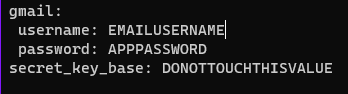

# The Story Tavern

Is an application for sharing short stories with others. Stories are tagged with genres they apply to and users can react to them with a variety of emotes.

## Setup
This project is built with Ruby on Rails (2.7.4), Reactjs, and Postgresql 12. Please make sure 
to install and start up postgresql 12 and then in your backend terminal:

- bundle install
- rake db:migrate (and optionally in the same line db:seed)
- bin/rails credentials:edit (In order to automatically create the file config/master.key)
- Run `EDITOR=nano bin/rails credentials:edit` and while noting that yml is tab and sensitive create a 'gmail' object the object should have username and password keys. nano is my default text editor, but note yours may be different.

While the username is simply the username to the email account, the password must be an 'app password.' If you are unsure of how to acquire one,
go [here](https://support.google.com/mail/answer/185833?hl=en) or if the link has broken, search a google smtp app password guide. As of this time,
the app password they supply contains spaces in a few places. Omit those when putting them in the credentials file, what you should have is a 16 character alphabetic string.
If gmail is not your preffered mail provider, the steps will look similar but you will need to go to lines 74 and 75 of config/environments/theenvironmentyourusing and
adjust `Rails.application.credentials.gmail[:username]` to access whatever you named the object instead of gmail. Or call it gmail anyways and feed it a yahoo email to add confusion. In addition, adjust the `address` key a few lines up to your service. Overall, this is how your file should look like this:

- Run rails s to start the backend server
- Open a new terminal
- Choose to cd into client or torture yourself by appending --prefix client for the following commands
- npm install
- npm start

## Usage

To view stories, navigate to them and click the little book by their icon in order to reach their particular page.

If you wanted to create or modify stories of your own, or be able to emote, create an account to cause the appropriate buttons to do so to appear/become clickable.

Admin accounts (access level 1, which can only be set in the server console using `rails c` and updating a user with ActiveRecord commands) can
also navigate to /genres and add, modify, or delete genres there, in addition to being able to delete any story for a aid of moderation.

## Contributing

Not currently. Feel free to modify and use as a base for your own version, however.

## Project-Status

On-Going. Current Unimplemented Stretch goals are:
- A forgot password function (this involves email)
- A reset password function (this involves email)
- Editable Users (Sends email on success)
- In addition to a user account edit dashboard, make their profile show stories they've created
- Require password to delete account

## Contact

If you are having trouble, contact thepuddingdeity@gmail.com with the subject as: The Story Tavern or open an Issue here on github.

## Sources

Artwork on the front page is from the Toledo Museum - John Lewis Krimmel (American, 1786-1821) Village Tavern. Oil on canvas, 1813-1814.

## License

[MIT](https://choosealicense.com/licenses/mit/)